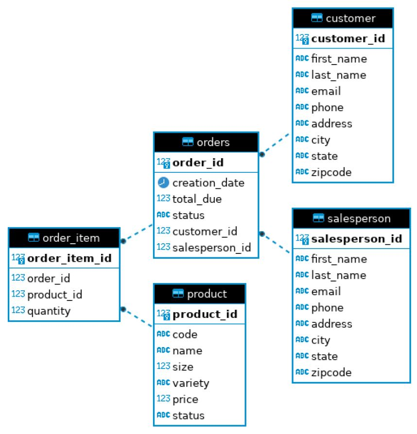

# Introduction
(50-100 words)

CustomerDAO (data access object) which performs CRUD operations on customer table of hplussport database stored in docker psql instance. also contains a database connection Manager class to connect to JDBC URL which contains the database and host and username and password. Technologies used are JDBC to manipulate data in database using CRUD operations and Customer objects, PSQL to acess database, MVN, Docker, intelliji and git/ github.

# Implementation
## ER Diagram

## Design Patterns
Discuss DAO and Repository design patterns (150-200 words)

DAO is a Data Access Object and is a class that uses CRUD operations on an object in the project. an object can be one row in the database table (for instance a customer object attributes (columns)) or an object can be the result of a query. a DTO is a Data Transfer Object and it is a model or java object in the DAO (for instance, in this project we used a Customer Object as our DTO). When we create a DTO ( new customer Object) we add it to the database via the DAO (CustomerDAO). Similarly, if we want to delete a DTO we delete it via DAO. Overall, DAO hides low-level implementation and keeps business and database logic separate giving greater flexibility.

The Repository pattern focuses only on single table access per class. Instead of doing joinings in the database, you join it in code meanwhile in DAO, you would do it with SQL using keys for joins. Repositories also facilitate distributing and sharding database (scaling out) versus (DAO) which is better for scaling vertically.

# Test
How you test your app against the database? (e.g. database setup, test data set up, query result)

Database setup:

`psql -h localhost -U postgres -f database.sql`

`psql -h localhost -U postgres -d hplussport`

`psql -h localhost -U postgres -d hplussport -f product.sql`

`psql -h localhost -U postgres -d hplussport -f salesperson.sql`

 `psql -h localhost -U postgres -d hplussport -f orders.sql`
 
SQL files are from exercise files of Lynda course

Since we used Lynda course on JDBC to follow along with the implementation of this project, I followed along with the testing implementation, which consisted of testing being done on JDBCExecutor class. a connection was opened using the DatabaseConnectionManager object in the JDBCExecutor class. if the connection is successful our CustomerDAO object is initiated. from there I tested the CustomerDAO class by creating new Customer objects and setting their attributes with setter methods and printing the resulting object to see what ID it had been assigned based on id auto-incrementing primary key.

with that ID I would use the query in the psql REPL (client program) in the command line:

EX.
`SELECT * FROM customer where customer_id= 1000`

And compared it against the DTO in the JDBCExecutor class.
if an object was deleted I would check that customer no longer existed with the same query above.
Similarly, if an object was updated I would check that the customers attribute fields that were changed VIA the customerDAO are the same as the ones changed on the Customer DTO.

