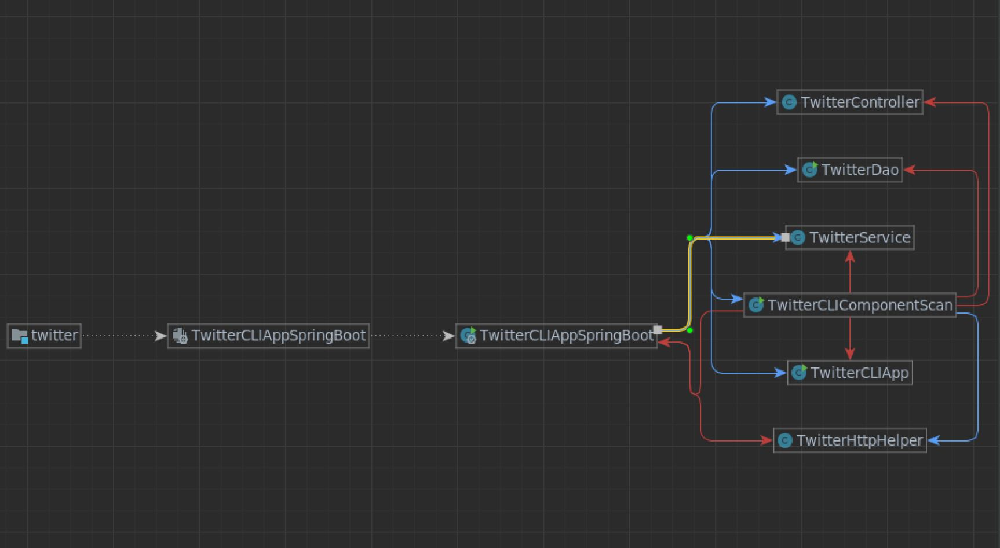

# Introduction
(50-100 words)
What does this app do? What technoglies you have used? (e.g. Twitter REST API, HTTP client, mvn, Java libs, docker etc..)

This Twitter Crud application makes calls to the official Twitter API to post, find and delete tweets. Technologies used are the Twitter REST API to make api calls, HTTP client, maven, Java and docker. implemented Data Access Object (DAO) pattern. The Twitter DAO and HttpHelper is seperated from the business logic of the app, and is where the API calls and API URL strings are formed with the help of the OAuthConsumer and HttpHelper libraries. 

# Quick Start
- how to package your app using mvn?
  -- mvn clean package
- how to run your app with docker?
 - created dockerfile, build image from docker file and finally run the app on docker:
 - docker pull carlagcasta/twitter
 - docker run --rm \
 ${docker_user}/twitter post|show|delete [options]

# Design
## UML diagram

spring dependencies diagram

## explain each component(app/main, controller, service, DAO) (30-50 words each)
- App/main
  
- Controller
  
- Service
- 

- DAO

## Models
Talk about tweet model

## Spring
- How you managed the dependencies using Spring?

# Test
How did you test you app using Junit and mockito?

## Deployment
How did you dockerize your app.

# Improvements
- improvements
