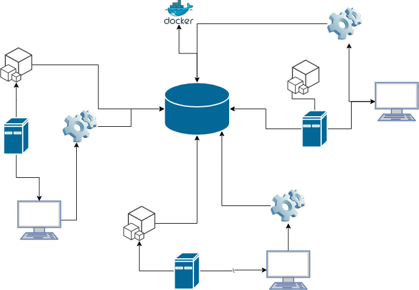

# Linux Cluster Monitoring Agent
This project is under development. Since this project follows the GitFlow, the final work will be merged to the main branch after Team Code Team.

Note: You are NOT allowed to copy any content from the scrum board, including text, diagrams, code, etc. Your Github will be visible and shared with Jarvis clients, so you have to create unique content that impresses your future boss😎.

# Introduction
(about 150-200 words)
Discuss the design of the project. What does this project/product do? Who are the users? What are the technologies you have used? (e.g. bash, docker, git, etc..)

LCA wants to manage a cluser of linux computers and wants to collect server usage about each host every minue that the server is healthy and running.
The project has a RDBMS database using a psql instance from docker, with collected data about each node/servers in the networks hardware specifications as well as resource usages (CPU/Memory) for the Jarvis Linux Cluster Administration (LCA) which manages a linux cluster of 10 nodes/servers running CentOS7 
and they want to use this data for reports and planning purposes. The LCA manager will be able to see the collected data in the database 
and find ways to manage the cluster for efficiently.

The technologies used to complete this project include include bash and shell scripts, git, docker, linux command lines, postgresSQL, Intelliji

# Quick Start
Use markdown code block for your quick-start commands
- Start a psql instance using psql_docker.sh `./scripts/psql_docker.sh start`
- Create tables using ddl.sql `./sql/ddl.sql `
- Insert hardware specs data into the DB using host_info.sh `./scripts/host_info.sh [psql_host] [psql_port] [db_name] [psql_user] [psql_password]`
- Insert hardware usage data into the DB using host_usage.sh `./scripts/host_usage.sh [psql_host] [psql_port] [db_name] [psql_user] [psql_password]`
- Crontab setup `bash> crontab -e` insert into the file `* * * * * bash /home/centos/dev/jrvs/linux_sql/scripts/host_usage.sh localhost 5432 host_agent postgres password > /tmp/host_usage.log`

# Implemenation

created a psql instance with docker. from there created a database called host_agent using PSQL REPL and the ddl.sql file which contains
sql ddl statments to created tables called 
host_info and host_usage which would store information about hardware specs and server usage.
created shell scripts host_info.sh and host_usage.sh to collect this information via bash commands
stored in variables and inserted into the database tables respectively. host_usage.sh should execute evertime
server is up and running every minute and inserting into database table host_usage which was implemented using crontab in Linux. we also have a ddl.sql file which createdthe database tables if not created already and a psql_docker.sh shell script which creates, stops or starts an instance of the psql docker container.
Used git and github to keep track of feature branches and devlopment changes throughout the project.

## Architecture
Draw a cluster diagram with three Linux hosts, a DB, and agents (use draw.io website). Image must be saved to the `assets` directory.

## Scripts
Shell script description and usage (use markdown code block for script usage)
- psql_docker.sh: creates starts or stops psql docker instance `./scripts/psql_docker.sh start|stop|create [db_username][db_pass]`
- host_info.sh: gathers hardware specs about current host and inserts into host_info database table `./scripts/host_info.sh [psql_host] [psql_port] [db_name] [psql_user] [psql_password]`
- host_usage.sh: gathers server usage data about current host and inserts into host_usage database table `./scripts/host_usage.sh [psql_host] [psql_port] [db_name] [psql_user] [psql_password]`
- crontab: command used to execute script every minute. contab file is edited to include the 
script we are trying to execute every minute.
- queries.sql (describe what business problem you are trying to resolve)
  the manager wants to use the information collected in the database table to manage the resources of
the cluster better with a few queries such as sorting the hosts by memory size, their average memory usage over 5 minute intervals
and checking whenever the server fails.

## Database Modeling
Describe the schema of each table using markdown table syntax (do not put any sql code)
- `host_info`

| `Label`    	   | `Name`             | `Type`             | `Nullable` | `Default` | `Comment` |
| ---------------- | ------------------ | ------------------ | ---------- | --------- | --------- |
| id        	   | host_id            | int auto_increment | `false`    | PRIMARY KEY          |           |
| hostname   	   | LastName           | varchar(50) UNIQUE | `false`    |           |  UNIQUE KEY         |
| cpu_number 	   | cpu_number         | varchar(50)        | `false`    |           |           |
| cpu_architecture | cpu_architecture   | varchar(50)        | `false`    |           |           |
| cpu_model        | cpu_model          | varchar(50)        | `false`    |           |           |
| cpu_mhz          | cpu_mhz            | varchar(50)        | `false`    |           |           | 
| L2_cache         | L2_cache           | int                | `false`    |           |           | 
| total_mem        | total_mem          | int                | `false`    |           |           | 
| timestamp        | total_mem          | timestamp          | `false`    |           |           | 
 

- `host_usage`

| `Label`    	   | `Name`             | `Type`             | `Nullable` | `Default` | `Comment` |
| ---------------- | ------------------ | ------------------ | ---------- | --------- | --------- |
| timestamp        | timestamp          | TIMESTAMP          | `false`    |           |           |
| host_id   	   | host_id            | INT                | `false`    |    FOREIGN KEY       |   pointing to 'id' primary key of host_info table        |
| memory_free 	   | memory_free        | INT                | `false`    |           |           |
| cpu_idle         | cpu_idle           | INT                | `false`    |           |           |
| cpu_kernel       | cpu_kernel         | INT                | `false`    |           |           |
| disk_io          | disk_io            | INT                | `false`    |           |           | 
| disk_available   | disk_available     | INT                | `false`    |           |           | 
       
 

# Test
How did you test your bash scripts and SQL queries? What was the result?

I used Intelliji Ultimates built in database tool to troubleshoot and test SQL queries.
for the bash scripts I was able to test and troubleshoot them with the bash commands using vim command 
tested against testing data to verify sql scripts were correct
# Deployment

using Github to keep code , and host_usage script is managed by the crontab job.
Database is managed by Docker using psql instance.

# Improvements

- handle hardware update 
- handle deployment
- SQL queries (testing and effiency)
